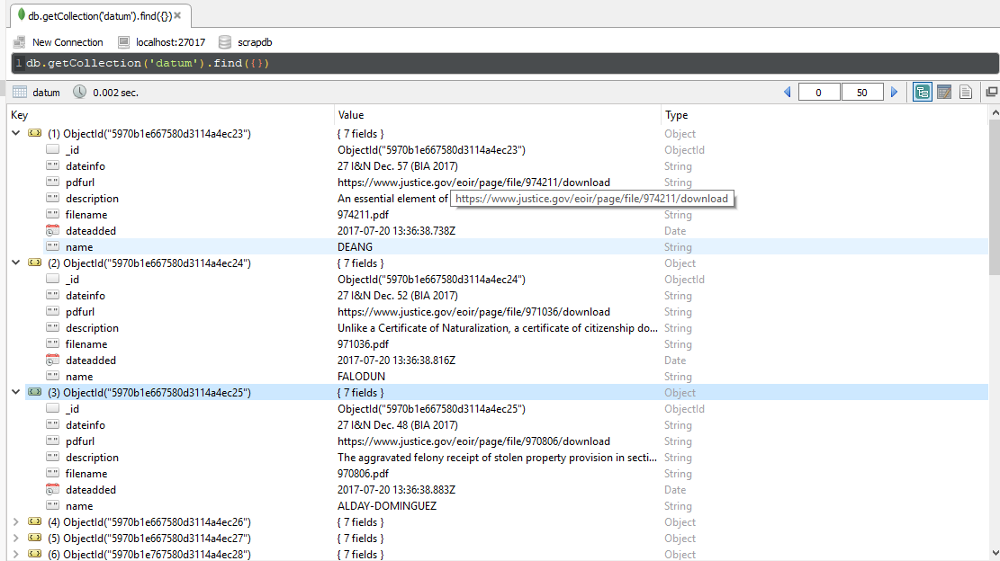
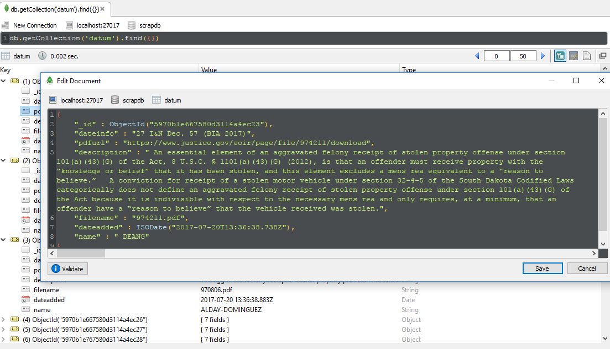

## Scrap Project
- Database : mongoDB
- DB Name : scrapdb
- Collection Name : datum
- Used beautifulsoup4 for scraping

## Install Python2.7

https://letmespeakweb.wordpress.com/2016/08/15/how-to-install-python-2-7-10-on-ubuntu-16-04/

## Install MongoDB

https://www.howtoforge.com/tutorial/install-mongodb-on-ubuntu-16.04/

## Install Python packages from requirements.txt

pip install requirements.txt

## ScreenShots
- Database Screenshot - 1

- Database Screenshot - 2

